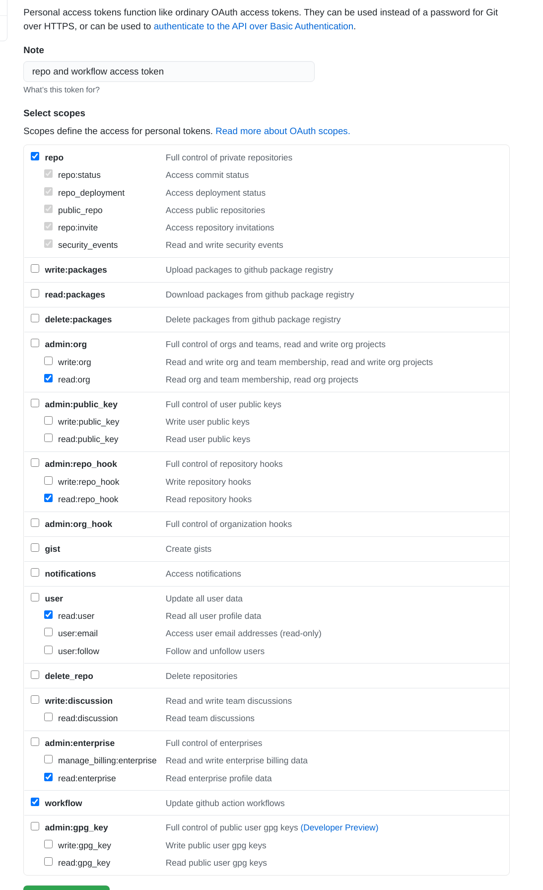

# View the status of Github Actions for a repo in CLI


## Requirements
 - python3
 - bash shell

## Setup (Automatic / recommended)
1. Clone or download this repo
1. Follow [this](https://docs.github.com/en/github/authenticating-to-github/creating-a-personal-access-token) guide to make a personal access token. [This](https://github.com/settings/tokens) link should take you to the github settings page to create a token
1. Create the token with repo and workflow access  (or just check every box to be safe)
1. Save the token to a text file in this repo called `token.txt`
    ```
        ├── actionsStatus.py
        ├── add_bash_aliases.sh
        ├── README.md
        └── token.txt
    ```
1. Run the `add_bash_aliases.sh` script
   - Changes to the `.bashrc` file take effect upon reloading it via `bash` or opening a new terminal window


## Usage
If setup correctly, then the script will add 2 new bash commands
 - `gp` which will do a git push then run `gitActionsStatus`
 - `gitActionsStatus` which will run the script
   - Can be called in any directory that has a `.git` folder

When running `gp` it will execute a standard `git push` and then display a table of the current status of all actions that were running
```
nick:~/Git/actionsTest$ gp
Enumerating objects: 5, done.
Counting objects: 100% (5/5), done.
Delta compression using up to 8 threads
Compressing objects: 100% (3/3), done.
Writing objects: 100% (3/3), 309 bytes | 309.00 KiB/s, done.
Total 3 (delta 2), reused 0 (delta 0)
remote: Resolving deltas: 100% (2/2), completed with 2 local objects.
To github.com:nickssmith/actionsTest.git
   15fa25a..53d1be9  test1 -> test1

+------------------------+-------------+---------+
|               Workflow |      Status |  Result |
+------------------------+-------------+---------+
| TODO and comment check |   completed | failure |
+------------------------+-------------+---------+
|          Lint Markdown |   completed | failure |
+------------------------+-------------+---------+
|              MD to PDF | in_progress |         |
+------------------------+-------------+---------+
|         Check Spelling | in_progress |         |
+------------------------+-------------+---------+

```
Once all actions finish a table of all failed actions and their logs will be displayed
```
+------------------------+-----------+---------+-+
|               Workflow |    Status |  Result | |
+------------------------+-----------+---------+-+
| TODO and comment check | completed | failure | |
+------------------------+-----------+---------+-+
|          Lint Markdown | completed | failure | |
+------------------------+-----------+---------+-+
|              MD to PDF | completed | success | |
+------------------------+-----------+---------+-+
|         Check Spelling | completed | failure | |
+------------------------+-----------+---------+-+
Failed runs logs can be found at
+------------------------+------------------------------------------------------------------+
|          Lint Markdown | https://github.com/nickssmith/actionsTest/actions/runs/168014123 |
+------------------------+------------------------------------------------------------------+
| TODO and comment check | https://github.com/nickssmith/actionsTest/actions/runs/168014121 |
+------------------------+------------------------------------------------------------------+
|         Check Spelling | https://github.com/nickssmith/actionsTest/actions/runs/168014117 |
+------------------------+------------------------------------------------------------------+
```
NOTE: it may take a moment between the all actions finishing and the table being displayed

The program can be closed at any time with `ctrl-c`

After each run it will do a check for updates from the master branch of this repo and pull them if needed

## Manual Install / Setup

Can be skipped if the automatic setup worked

All that must be done is add the call `python3 /path/toactionStatus.py` to somewhere in your path and call it after `git push`

See the contents of the `.sh` script for details. 

## TODO LIST
 - check for new PRs made by actions and report them
 - show logs in console instead of links